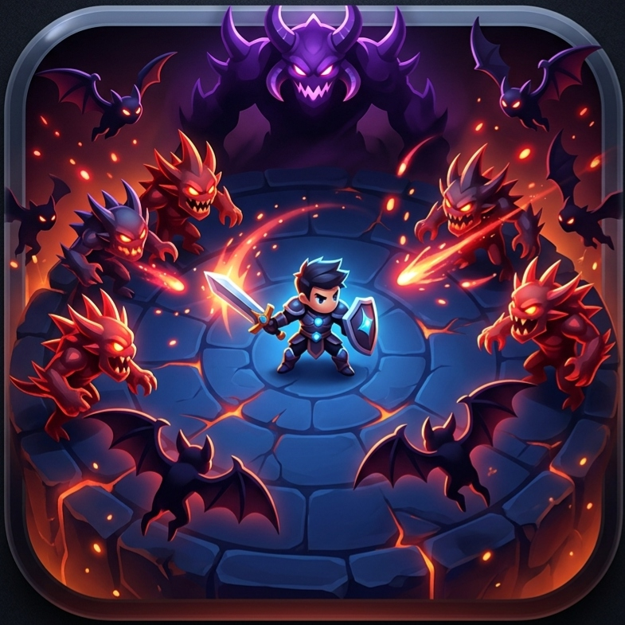

# 🔫 Nightmare Trigger - 3D Horror FPS

[](#)   [](#)   [](https://threejs.org/)   [](LICENSE)


> **Face your nightmares** – A fast-paced, browser-based 3D first-person shooter built with Three.js. Survive the timer, hunt down monsters, and conquer the shifting realms.



---

## 🕹️ Gameplay

- **Survival Mode**: Survive 120 seconds of pure nightmare.
- **Dynamic Difficulty**: As your score increases, enemies gain speed and aggression.
- **Realm Shifts**: The environment's atmosphere and background color change as you reach score milestones.
- **High Score Tracking**: Your "Nightmare High Score" is saved locally to your browser.

---

## ✨ Features

### 🧟 The Horde

- **Melee Stalkers**: Spiked monstrosities that chase you relentlessly.
- **Skeletal Archers**: Static sentinels that snipe from a distance with projectile arrows.
- **Nightmare Bats**: High-speed aerial threats with animated wing flaps.
- **The Boss**: A massive, high-HP purple titan that appears at major score thresholds.

### 💊 Power-Ups

| Type                 | Effect                                   | Visual     |
| -------------------- | ---------------------------------------- | ---------- |
| **Health**     | Instantly restores +25 HP                | Green Orb  |
| **Slow-Mo**    | Dilates time, slowing all enemies for 6s | Blue Orb   |
| **Multi-Shot** | Triple-spread fire for 8s                | Orange Orb |

---

## 🎮 Controls

| Action             | Desktop                  | Mobile                  |
| ------------------ | ------------------------ | ----------------------- |
| **Movement** | `W A S D` / Arrow Keys | (Movement follows look) |
| **Look/Aim** | Mouse Drag               | Swipe Screen            |
| **Shoot**    | Click / Tap              | Click / Tap             |
| **Audio**    | Toggle 🔊 Top-Right      | Toggle 🔊 Top-Right     |

---

## 🚀 How to Play the Game

### Direct Access

> **[▶️ Click Here to Play the Game Directly in Your Browser (Live Demo)](https://link-to-be-added-later)**

### Local Setup (For Offline Play)

1. Clone the repository:
   ```bash
   git clone https://github.com/your-username/nightmare-trigger.git
   ```
2. Navigate to the directory:
   ```bash
   cd nightmare-trigger
   ```
3. Open `index.html` in your browser.

---

## 🛠️ Project Structure

This project uses a clean modular architecture:

- `index.html`: Entry point and UI.
- `style.css`: Visual effects and interface design.
- `script.js`: Core game engine and Three.js physics.

---

## 🔮 Future Enhancements

- **Enhanced Enemy Roster**: Ghosts, skeleton mages, and a final campaign boss.
- **Power‑up Synergy**: Combinations like Speed Boost + Multi-Shot.
- **Immersive Soundscape**: Optional background music and spatial sound effects.
- **Wave-Based Progression**: Increasing difficulty tiers.
- **Collection System**: Achievements and unique unlockable skins.
- *(Have an idea? Open an issue or a pull request!)*

---

## 🤝 Contributing

Contributions are welcome! If you’d like to improve the nightmare:

1. Fork the repo.
2. Create a feature branch.
3. Commit your changes.
4. Open a pull request.

Please star the repository if you enjoy the game – it helps others discover it!

---

## 📜 License

This project is licensed under the MIT License - see the [LICENSE](LICENSE) file for details.

---

*If you enjoyed the nightmare, consider giving this repo a ⭐!*
